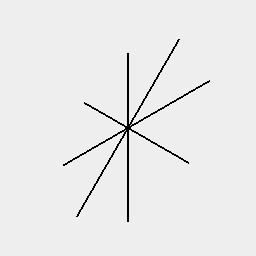
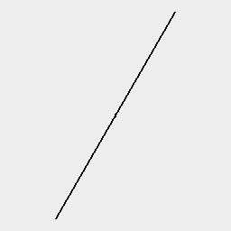

### n()
Parameter|Default|Type
---|---|---
...indices||The indices of the leaves to extract.

Extracts leaf geometry by index.

A longhand operator nth() is equivalent.

See: [nth](../../nb/api/nth.md)

```JavaScript
Line(0.1, 5)
  .seq({ by: 1 / 8 }, rz)
  .view(1)
  .note('All of the lines are included.')
  .n(0, 3, 6)
  .view(2)
  .note(
    'Line(0.1, 5).seq({ by: 1 / 8 }, rz).n(0, 3, 6) extracts lines 0, 3, and 6.'
  );
```



All of the lines are included.



Line(0.1, 5).seq({ by: 1 / 8 }, rz).n(0, 3, 6) extracts lines 0, 3, and 6.
