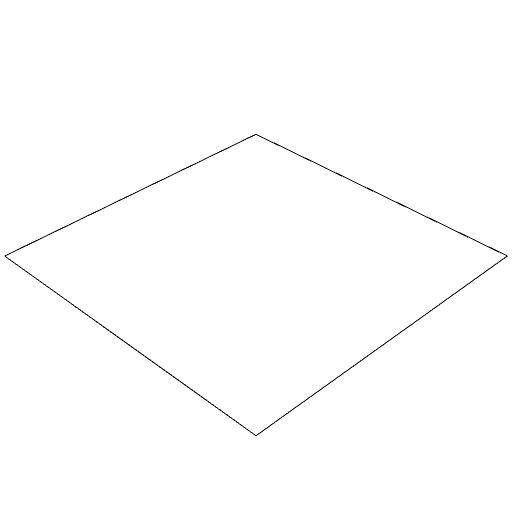

### noOp()
Just returns the incoming shape.

```JavaScript
Box()
  .eachEdge(noOp())
  .view()
  .note('Box().eachEdge(noOp()) produces each edge as is.');
```



Box().eachEdge(noOp()) produces each edge as is.
