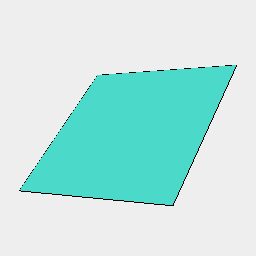

[index](../../nb/api/index.md)
### noOp()
Just returns the incoming shape.



Box().noOp() just produces the box.

```JavaScript
Box()
  .noOp()
  .view()
  .note('Box().noOp() just produces the box.');
```
