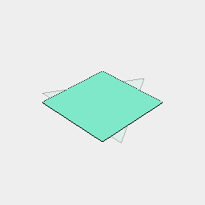
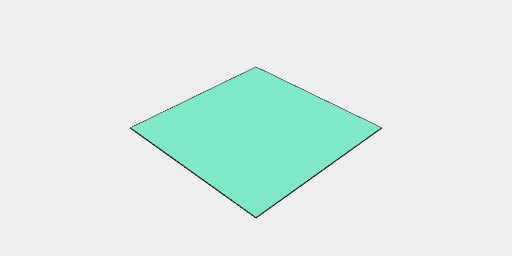

[index](../../nb/api/index.md)
### noVoid

Removes void geometry from the incoming shape.

Equivalent to on(get('type:void'), Empty()).

```JavaScript
Group(Box(), Triangle(1.5).void())
  .view(1)
  .note('With void')
  .noVoid()
  .view(2)
  .note('noVoid() removes the void triangle.');
```



With void



noVoid() removes the void triangle.
