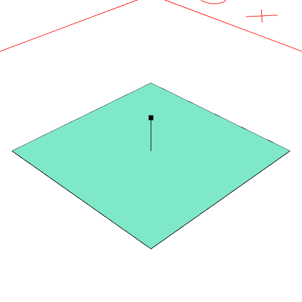
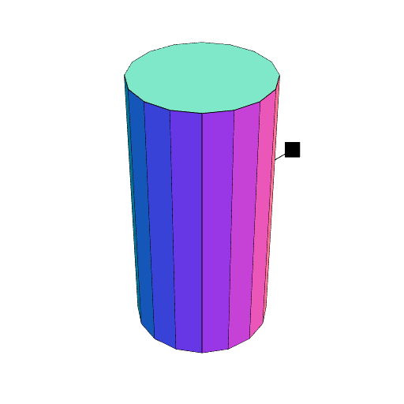

### normal()
Produces a reference point along the direction normal to the shape.

This can be visualized as a point.

For complex shapes the normal may be somewhat arbitrary and unintuitive.

See [extrudeAlong](../../nb/api/extrudeAlong.nb), [moveAlong](#https://raw.githubusercontent.com/jsxcad/JSxCAD/master/nb/api/moveAlong.md).

```JavaScript
Box(5)
  .and((s) => Edge(Point(), s.normal()), normal())
  .view()
  .note('Box(5).and((s) => Edge(Point(), s.normal()), normal())');
```



Box(5).and((s) => Edge(Point(), s.normal()), normal())

```JavaScript
Arc(1, 1, 2)
  .and((s) => Edge(Point(), s.normal()), normal())
  .view()
  .note('Arc(1, 1, 2).and((s) => Edge(Point(), s.normal()), normal())');
```



Arc(1, 1, 2).and((s) => Edge(Point(), s.normal()), normal())
