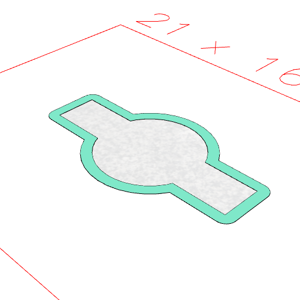

### offset()
Parameter|Default|Type
---|---|---
initial|1|Number of mm to initially offset by.
{segments}|16|Number of segments for corners.
{step}||Number of mm for subsequent offsetting.
{limit}||Maximum mm to inset by.

Produces a surface inscribed around the shape.

See: [inset](../../nb/api/inset.md).

```JavaScript
Arc(5)
  .join(Box(10, 2, 2))
  .cutFrom(offset(0.5))
  .view()
  .note('Arc(5).join(Box(10, 2, 2)).cutFrom(offset(0.5))');
```



Arc(5).join(Box(10, 2, 2)).cutFrom(offset(0.5))

```JavaScript
Arc(5)
  .join(Box(10, 2, 2))
  .cutFrom(offset(0.5, { step: 0.5, limit: 5 }))
  .view()
  .note(
    'Arc(5).join(Box(10, 2, 2)).cutFrom(offset(0.5, { step: 0.5, limit: 5 })) produces further offsets.'
  );
```


Arc(5).join(Box(10, 2, 2)).cutFrom(offset(0.5, { step: 0.5, limit: 5 })) produces further offsets.
