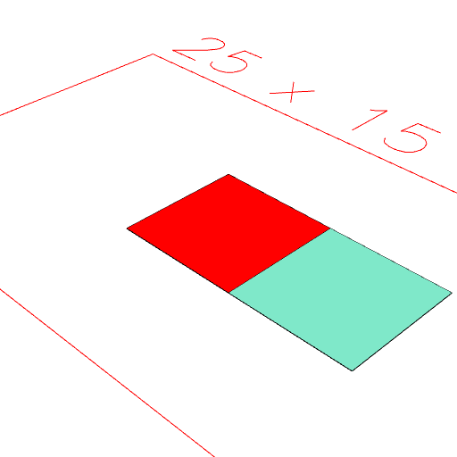

### origin()
Produces a reference point showing the transform required to move the object to its local origin.

This can be visualized as a point.

See [normal](../../nb/api/normal.md).

```JavaScript
Box(5)
  .x(5)
  .and(color('red').by(origin()))
  .view()
  .note(
    "Box(5).x(5).and(color('red').by(origin())) adds a red version of the box back at the origin."
  );
```



Box(5).x(5).and(color('red').by(origin())) adds a red version of the box back at the origin.
