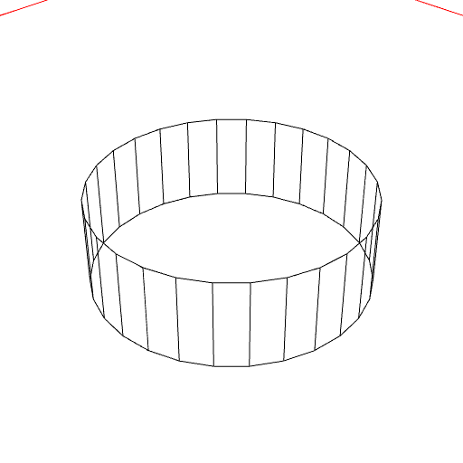

### outline()
Produces segments representing the geometric edges of the shape.

See: [edges](../../nb/api/edges.md)

```JavaScript
Arc(3, 3, 1)
  .outline()
  .view()
  .note('Arc(3, 3, 1).outline() shows the geometric shape.');
```



Arc(3, 3, 1).outline() shows the geometric shape.
