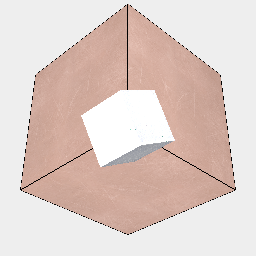

### overlay()
Mark the shape to be displayed over the top of normal geometry.

```JavaScript
Box(5, 5, 5)
  .material('copper')
  .and(
    Box(2, 2, 2)
      .ry(1 / 6)
      .material('steel')
      .overlay()
  )
  .view()
  .note(
    "Box(5, 5, 5).material('copper').and(Box(2, 2, 2).ry(1 / 6).material('steel').overlay() shows the steel box (which is inside the copper box) overlaid on top of the steel box."
  );
```



Box(5, 5, 5).material('copper').and(Box(2, 2, 2).ry(1 / 6).material('steel').overlay() shows the steel box (which is inside the copper box) overlaid on top of the steel box.
