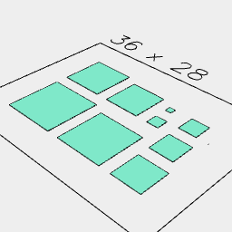
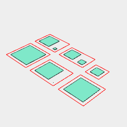

[index](../../nb/api/index.md)
### pack()
Parameter|Default|Type
---|---|---
sheets|[]|Shapes to pack into.
orientations|[]|List of z turns for orienting pieces.
{perimeterWeight}|1|Importance of perimeter minimization.
{boundsWeight}|1|Importance of not increasing bounding box.
{holesWeight}|1|Importance of not adding holes.

Packs the input objects into a set of sheets.

Items are packed as individual shapes.

Items which do not fit into any sheet are packed into a final unbounded sheet.

The packaged sheet is an item, accessing the content will require using in().

See: [in](../../nb/api/in.md)

And(Triangle(1).ez([1]), Arc(1).ez([1]), Hexagon(1).ez([1])).copy(3).pack(1 / 6, 2 / 6, 3 / 6, Arc(6).cut(Hexagon(4)), { perimeterWeight: 1, boundsWeight: 1, holesWeight: 1 })



```JavaScript
And(Triangle(1).ez([1]), Arc(1).ez([1]), Hexagon(1).ez([1]))
  .copy(3)
  .pack(1 / 6, 2 / 6, 3 / 6, Arc(6).cut(Hexagon(4)), {
    perimeterWeight: 1,
    boundsWeight: 1,
    holesWeight: 1,
  })
  .note(`And(Triangle(1).ez([1]), Arc(1).ez([1]), Hexagon(1).ez([1])).copy(3).pack(1 / 6, 2 / 6, 3 / 6, Arc(6).cut(Hexagon(4)), { perimeterWeight: 1, boundsWeight: 1, holesWeight: 1 })`)
  .view()
```

Hexagon(2).color('red').copy(20).pack(1 / 12, Box(8).copy(3)).pack()



```JavaScript
Hexagon(2)
  .color('red')
  .copy(20)
  .pack(1 / 12, Box(8).copy(3))
  .pack()
  .note(`Hexagon(2).color('red').copy(20).pack(1 / 12, Box(8).copy(3)).pack()`)
  .view()
```
