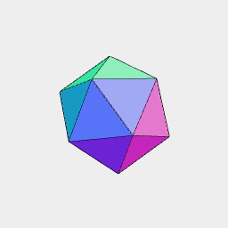

[index](../../nb/api/index.md)
### png()
Parameter|Default|Type
---|---|---
input||The geometry to render as a png.
transform||A function to transform the geometry first.
length|number|The x dimension length.
width|number|The y dimension length.
height|number|The z position to look down from.
resolution|number|The pixel size in mm.
{width,height,resolution}|options|As options.
Raycast geometry to generate a png using normal to determine color.



[icosahedron.png](png.icosahedron.png)

Icosahedron(3, 3, 3).rx(1/6).png('icosahedron', 10, 10, 10, 0.01)

```JavaScript
Icosahedron(3, 3, 3)
  .rx(1/6)
  .png('icosahedron', 10, 10, 10, 0.01)
  .note(`Icosahedron(3, 3, 3).rx(1/6).png('icosahedron', 10, 10, 10, 0.01)`);
```
