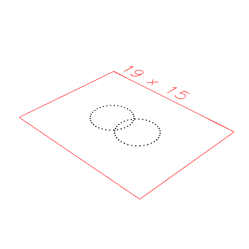

### points()

Produces a set of points from the incoming shape.

```JavaScript
Arc(5)
  .x(-2, 2)
  .points()
  .view()
  .note('Arc(5).x(-2, 2).points().view() produces a ring of points.');
```



Arc(5).x(-2, 2).points().view() produces a ring of points.

```JavaScript
Box(5, 5, 5)
  .op(ghost(), remesh(1).points())
  .view()
  .note(
    'Box(5, 5, 5).op(ghost(), remesh(1).points()) shows the points on the remeshes box surface.'
  );
```


Box(5, 5, 5).op(ghost(), remesh(1).points()) shows the points on the remeshes box surface.
