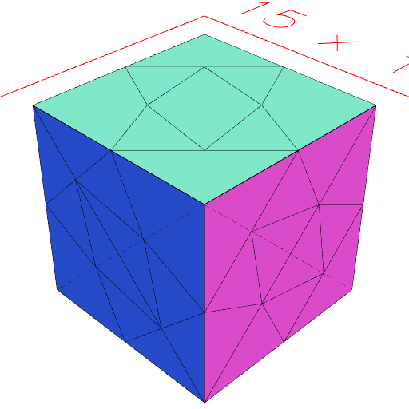
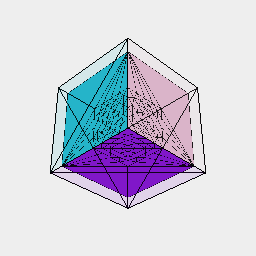

### remesh()
Parameter|Default|Type
---|---|---
resolution|1|Target edge length in mm.
...selectors|[]|Shapes to select the region to remesh.
{iterations}|1|How many times to run the remeshing algorithm.
{relaxationSteps}|1|
{targetEdgeLength}|resolution|Target edge length in mm.

Attempts to cover the geometric shape with isotropic facets.

The shape can be returned to its geometric triangulation via [demesh](../../nb/api/demesh.md).

See: [demesh](../../nb/api/demesh.md)

```JavaScript
Box(5, 5, 5).remesh(2.5).view('wireframe').note('Box(5, 5, 5).remesh(2.5)');
```



Box(5, 5, 5).remesh(2.5)

```JavaScript
Box(5, 5, 5).remesh(1).view('wireframe').note('Box(5, 5, 5).remesh(1)');
```


Box(5, 5, 5).remesh(1)

```JavaScript
Box(5, 5, 5)
  .remesh(0.5, Box([0, 5], [0, 5], [0, 5]))
  .and(Box([0, 5], [0, 5], [0, 5]).ghost())
  .view('wireframe')
  .note(
    'Box(5, 5, 5).remesh(0.5, Box([0, 5], [0, 5], [0, 5])) shows remeshing a part of a shape.'
  );
```



Box(5, 5, 5).remesh(0.5, Box([0, 5], [0, 5], [0, 5])) shows remeshing a part of a shape.
