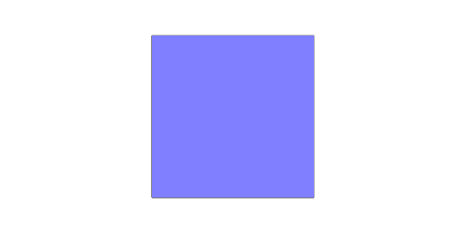
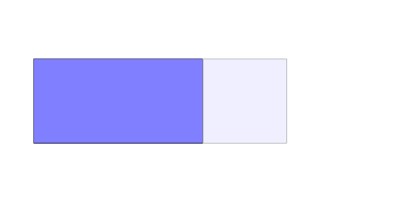
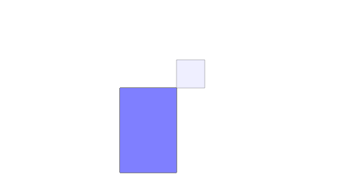
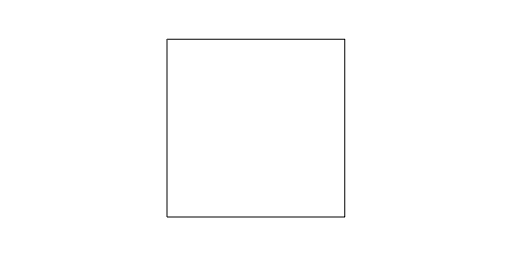
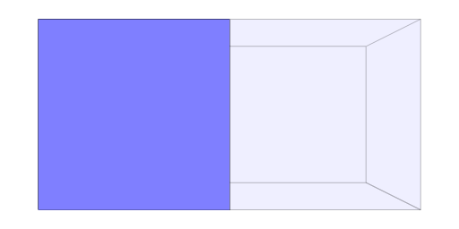
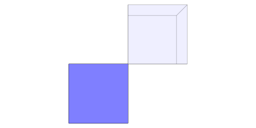

### scale()
...dimensions|[1, 1, 1]|Dimensions by which to scale.

The shape is scaled along those dimensions.

Negative dimensions are supported.

See: [scaleToFit](../../nb/api/scaleToFit.nb), [sx](#https://raw.githubusercontent.com/jsxcad/JSxCAD/master/nb/api/sx.nb), [sy](#https://raw.githubusercontent.com/jsxcad/JSxCAD/master/nb/api/sy.nb), [sz](#https://raw.githubusercontent.com/jsxcad/JSxCAD/master/nb/api/sz.md).

```JavaScript
Box(1, 1).scale(1, 1).topView().note('Box(1, 1).scale(1, 1)');
```



Box(1, 1).scale(1, 1)

```JavaScript
Box([0, 1], 1)
  .op(ghost(), scale(-2, 1, 1))
  .topView()
  .note('Box([0, 1], 1).scale(-2, 1)');
```



Box([0, 1], 1).scale(-2, 1)

```JavaScript
Box([0, 1], [0, 1])
  .op(ghost(), scale(-2, -3, 1))
  .topView()
  .note('Box([0, 1], [0, 1]).scale(-2, -3, 1)');
```



Box([0, 1], [0, 1]).scale(-2, -3, 1)

```JavaScript
Box(1, 1)
  .scale(1, 1, -1)
  .topView()
  .note('Box(1, 1).scale(1, 1, -1) the surface is now upside down.');
```



Box(1, 1).scale(1, 1, -1) the surface is now upside down.

```JavaScript
Box([0, 1], 1, 1)
  .op(ghost(), scale(-1, 1, 1))
  .topView()
  .note('Box([0, 1], 1, 1).scale(-1, 1, 1)');
```



Box([0, 1], 1, 1).scale(-1, 1, 1)

```JavaScript
Box([0, 1], [0, 1], 1)
  .op(ghost(), scale(-1, -1, 1))
  .topView()
  .note('Box([0, 1], [0, 1], 1).scale(-1, -1, 1)');
```



Box([0, 1], [0, 1], 1).scale(-1, -1, 1)
