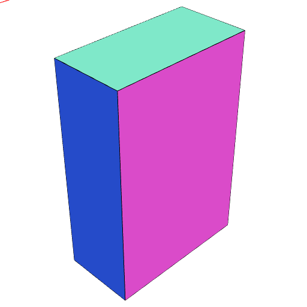
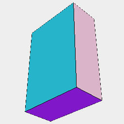

### scaleToFit()
Parameter|Default|Type
---|---|---
...dimensions|[1, 1, 1]|Dimensions of a bounding box to fill.

The shape is scaled to fit the bounding box dimensions.

See: [scale](../../nb/api/scale.md).

_Note: Should support ranged dimensions._

```JavaScript
Box(1, 1, 1).scaleToFit(1, 2, 3).view();
```



```JavaScript
Box(1, 2, 3).scaleToFit(3, 2, 1).view();
```


