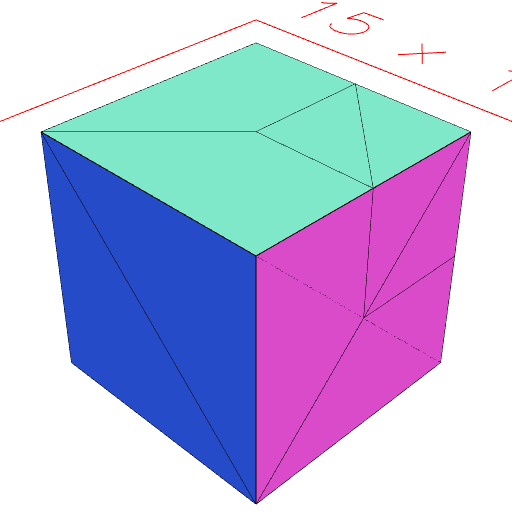
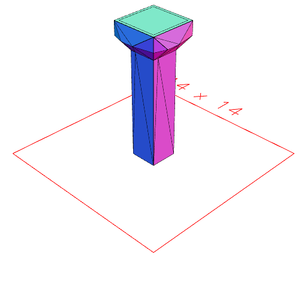

### seam()
Parameter|Default|Type
---|---|---
...selections||Shapes to select the areas to seam.

Add non-geometric edges where the selections intersect the shape.

See: [demesh](../../nb/api/demesh.nb), [remesh](#https://raw.githubusercontent.com/jsxcad/JSxCAD/master/nb/api/remesh.md).

```JavaScript
Box(5, 5, 5)
  .seam(Box([0, 5], [0, 5], [0, 5]))
  .view('wireframe')
  .note(
    'Box(5, 5, 5).seam(Box([0, 5], [0, 5], [0, 5])) adds seams around a corner'
  );
```



Box(5, 5, 5).seam(Box([0, 5], [0, 5], [0, 5])) adds seams around a corner

```JavaScript
Box(5, 5, 5)
  .seam(Arc(4, 3, 5))
  .view('wireframe')
  .note('Box(5, 5, 5).seam(Arc(4, 3, 5)) adds cylindrical seams');
```


Box(5, 5, 5).seam(Arc(4, 3, 5)) adds cylindrical seams

```JavaScript
Box(2, 2, [0, 10])
  .seam(Box(3, 3, [8, 10]))
  .grow(1, 'xy', Box(3, 3, [9, 10]))
  .view('wireframe')
  .note(
    "Box(2, 2, [0, 10]).seam(Box(3, 3, [8, 10])).grow(1, 'xy', Box(3, 3, [9, 10])) makes grow fold at the seam, rather than at the far end."
  );
```



Box(2, 2, [0, 10]).seam(Box(3, 3, [8, 10])).grow(1, 'xy', Box(3, 3, [9, 10])) makes grow fold at the seam, rather than at the far end.
