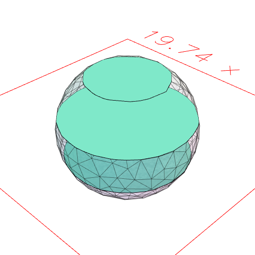
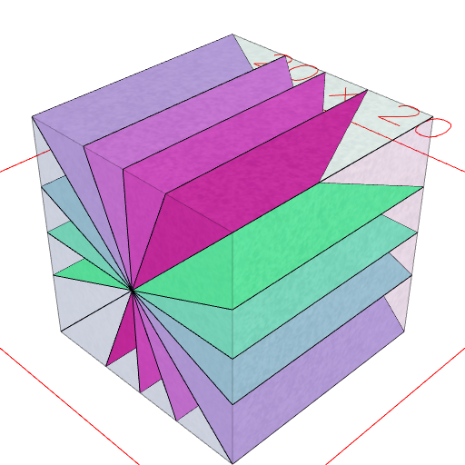

### section()
Parameter|Default|Type
---|---|---
...orientations||Cuts a cross-section through each orientation.

```JavaScript
Orb(10)
  .op(ghost(), section(XY().seq({ from: -5, to: 5, by: 3 }, z)))
  .view()
  .note(
    'Orb(10).section(XY().seq({ from: -5, to: 5, by: 3 }, z)) cuts horizontal sections through a sphere.'
  );
```



Orb(10).section(XY().seq({ from: -5, to: 5, by: 3 }, z)) cuts horizontal sections through a sphere.

```JavaScript
Box(10, 10, 10)
  .op(ghost(), section(XY().seq({ by: 1 / 16 }, ry)))
  .view()
  .note(
    'Box(10, 10, 10).section(XY().seq({ by: 1 / 16 }, ry)) cuts 16 rotated slices through a cube.'
  );
```



Box(10, 10, 10).section(XY().seq({ by: 1 / 16 }, ry)) cuts 16 rotated slices through a cube.
