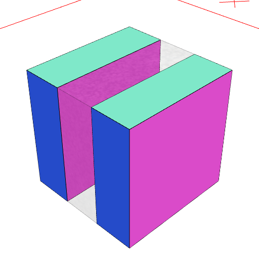
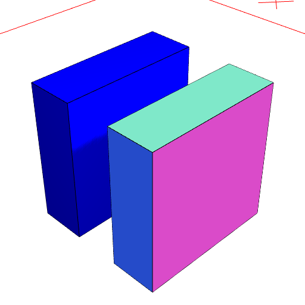
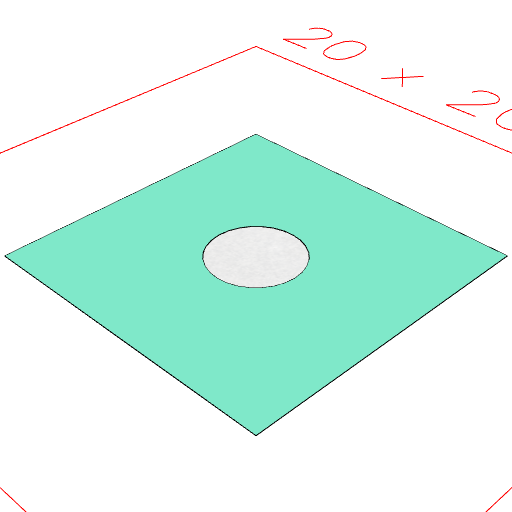
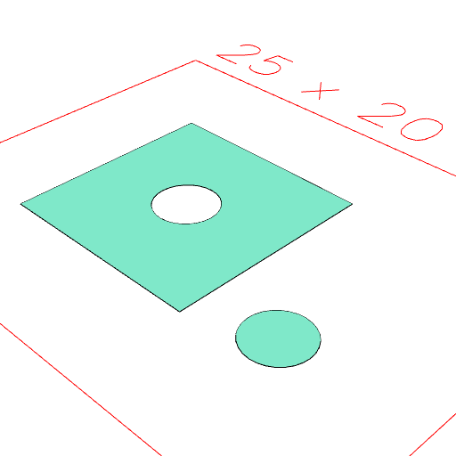

### separate()
Parameter|Default|Type
---|---|---
'noShapes'|false|Do not keep shapes.
'noHoles'|false|Do not keep holes in shapes.
'holesAsShapes'|false|Turn holes into shapes when separating.

Separates the disconnected elements of a shape.

```JavaScript
Box(3, 3, 3)
  .cut(Box(1, 3, 3))
  .view(1)
  .note(
    'Box(3, 3, 3).cut(Box(1, 3, 3)) produces a shape with two disconnected elements.'
  )
  .separate()
  .on(n(0), color('blue'))
  .view(2)
  .note(
    "separate().on(n(0), color('blue')) turns the first part blue, demonstrating that they are now separate shapes."
  );
```



Box(3, 3, 3).cut(Box(1, 3, 3)) produces a shape with two disconnected elements.



separate().on(n(0), color('blue')) turns the first part blue, demonstrating that they are now separate shapes.

```JavaScript
Box(10)
  .cut(Arc(3))
  .view(1)
  .note('Box(10).cut(Arc(3)) produces a box with a hole in it')
  .separate('holesAsShapes')
  .pack()
  .note("separate('holesAsShapes').pack() shows the extracted hole.")
  .view(3);
```



Box(10).cut(Arc(3)) produces a box with a hole in it

separate('holesAsShapes').pack() shows the extracted hole.


