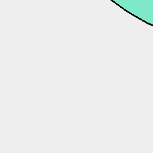
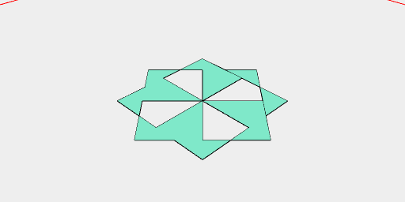
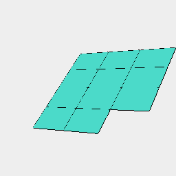

[index](../../nb/api/index.md)
### seq()
Parameter|Default|Type
---|---|---
{from}|0|Starting value.
{to}|1|Inclusive end value.
{upto}||Exclusive end value.
{by}|1|Step value.
op|noOp|Step function.
groupOp|Group|Grouping function.

Produces a sequence of numbers starting at _from_ and increasing by _by_.

If _upto_ is provided then _to_ is ignored.

_op_ is called with each produced number, then groupOp is called with the producd numbers as arguments. e.g., groupOp(...values). The incoming shape of seq is provided as context to _op_.



Box().seq({ from: 1, to: 3 }, offset) produces a group of three offsets from Box.

```JavaScript
Box()
  .seq({ from: 1, to: 3 }, offset)
  .view()
  .note(
    'Box().seq({ from: 1, to: 3 }, offset) produces a group of three offsets from Box.'
  );
```



Box([0, 1], [0, 1]).seq({ by: 1 / 8 }, rz).outline().fill()

```JavaScript
Box([0, 1], [0, 1])
  .seq({ by: 1 / 8 }, rz)
  .outline()
  .fill()
  .view()
  .note('Box([0, 1], [0, 1]).seq({ by: 1 / 8 }, rz).outline().fill()');
```



Box(89, 64).inset(3).offset(3).seq({ from: 1, to: 12 }).pack() produces 12 playing card outlines.

```JavaScript
Box(89, 64)
  .inset(3)
  .offset(3)
  .seq({ from: 1, to: 12 })
  .pack()
  .view()
  .note('Box(89, 64).inset(3).offset(3).seq({ from: 1, to: 12 }).pack() produces 12 playing card outlines.');
```
