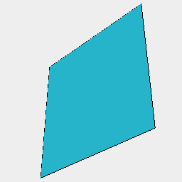

### size()
Parameter|Default|Type
---|---|---
op|size => shape => size|Operates on the size.

Analyzes the shape and calls op with an object with:
Field|Type|Note
---|---|---
length|number|Along the x axis.
width|number|Along the y axis.
height|number|Along the z axis.
max|point|The maximal corner.
min|point|The minimal corner.
center|point|The central point.
radius|number|The radius of a minimal sphere around center containing the shape.

```JavaScript
Box(3)
  .view()
  .size((size) => note(`${JSON.stringify(size, null, '

')}`));
```



{


"length": 3.000000000000008,


"width": 3.000000000000007,


"height": 6.4e-323,


"max": [


1.500000000000004,


1.5000000000000036,


3e-323


],


"min": [


-1.500000000000004,


-1.5000000000000036,


-3.5e-323


],


"center": [


0,


0,


0


],


"radius": 2.121320343559648
}
