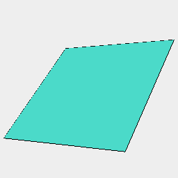
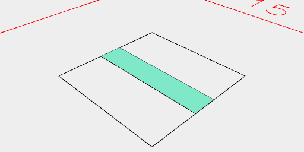
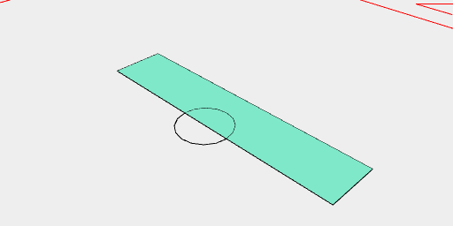

[index](../../nb/api/index.md)
### size()
Parameter|Default|Type
---|---|---
op|size => shape => size|Operates on the size.

Analyzes the shape and calls op with an object with:
Field|Type|Note
---|---|---
length|number|Along the x axis.
width|number|Along the y axis.
height|number|Along the z axis.
max|point|The maximal corner.
min|point|The minimal corner.
center|point|The central point.
radius|number|The radius of a minimal sphere around center containing the shape.



undefined

```JavaScript
Box(3)
  .view()
  .size('length', (length) => note(`${JSON.stringify(size, null, '

')}`));
```



```JavaScript
Box(5, 1)
  .and(Box(size('length')).outline())
  .view();
```



```JavaScript
Box(5, 1)
  .and(Arc().y(size('front')).outline())
  .view();
```
