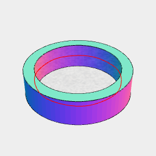

[index](../../nb/api/index.md)
### skeleton()
Parameter|Default|Type
---|---|---

Generates a set of skeletal segments from the volumes of the input geometry.

Note that skeletonization is sensitive to mesh density, so it may be necessary to prepare the volumes with remesh().



Arc(20).cut(inset(2)).ez(5).and(skeleton().overlay().color('red'))

```JavaScript
Arc(20)
  .cut(inset(2))
  .ez(5)
  .and(skeleton().overlay().color('red'))
  .view()
  .note(`Arc(20).cut(inset(2)).ez(5).and(skeleton().overlay().color('red'))`);
```
