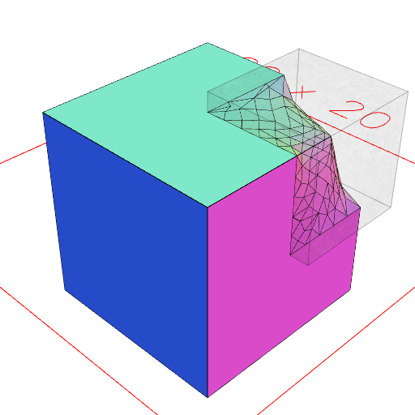

### smooth()
Parameter|Default|Type
---|---|---
resolution|1|How smooth to make it.
...selections||Only smooth where covered by a selection shape.
{iterations}|1|
{time}|1|
{remeshIterations}|1|
{remeshRelaxationSteps}|1|

Smooths shape.

```JavaScript
Box(10, 10, 10)
  .smooth(1, Box([0, 6], [0, 6], [0, 6]))
  .view()
  .note('Box(10, 10, 10).smooth(1, Box([0, 6], [0, 6], [0, 6]))');
```



Box(10, 10, 10).smooth(1, Box([0, 6], [0, 6], [0, 6]))
