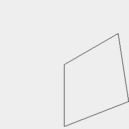
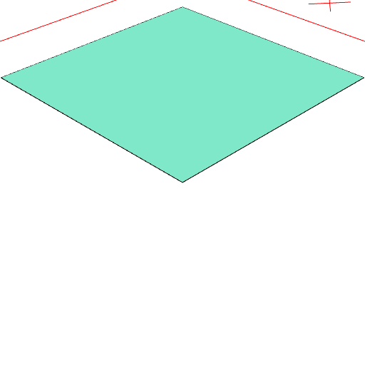
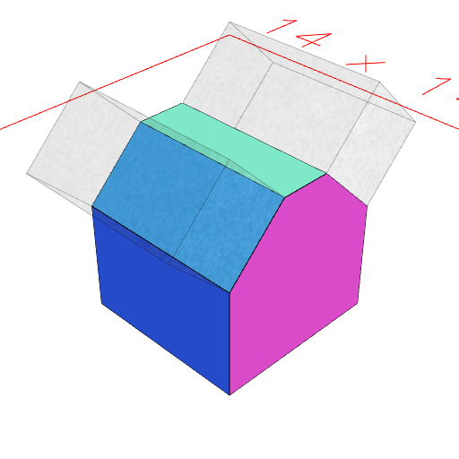

### sort()
Parameter|Default|Type
---|---|---
spec|'z<y<x<'|String defining the sort predicate.

This orders a group of shapes by their extremal bounding box corner.

e.g., if ordering by 'z>' the leaf with the greatest minimum z value is selected.

```JavaScript
Box(4, 4, 4)
  .faces()
  .op(
    n(0).view(1).note('Box(4, 4, 4).faces().n(0) selects an arbitrary face'),
    sort('z>')
      .n(0)
      .view(2)
      .note('Box(4, 4, 4).faces().sort().n(0) selects the top-most face')
  );
```



Box(4, 4, 4).faces().n(0) selects an arbitrary face



Box(4, 4, 4).faces().sort().n(0) selects the top-most face

```JavaScript
Box(4, 4, 4)
  .cut(
    eachEdge()
      .sort('z>y<x>')
      .n(0, 1)
      .op((e) => Box(2, 2, [0, 4]).to(e))
  )
  .view()
  .note('_Check this one_.');
```



_Check this one_.
