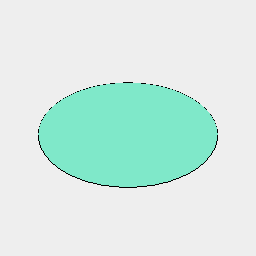
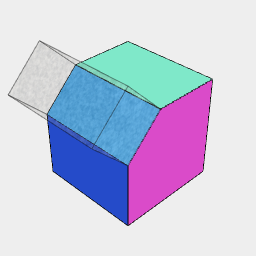
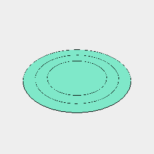

[index](../../nb/api/index.md)
### sort()
Parameter|Default|Type
---|---|---
rank|() => 0|Maps each shape to a rank.
'min'|true|Start with the minimum rank.
'max'|false|Start with the maximum rank.
keep|[]|Which ranks to keep, indexed from 1.

Seq({ to: 10 }, Arc).sort(area(), 'min').disjoint()



```JavaScript
Seq({ to: 10 }, Arc)
  .sort(area(), 'min')
  .disjoint()
  .note(`Seq({ to: 10 }, Arc).sort(area(), 'min').disjoint()`)
  .view();
```

Seq({ to: 10 }, Arc).sort(area(), 'max').disjoint()



```JavaScript
Seq({ to: 10 }, Arc)
  .sort(area(), 'max')
  .disjoint()
  .note(`Seq({ to: 10 }, Arc).sort(area(), 'max').disjoint()`)
  .view();
```

Seq({ to: 10 }, Arc).sort(area(), 'max', 1, 3, 5).disjoint()



```JavaScript
Seq({ to: 10 }, Arc)
  .sort(area(), 'max', 1, 3, 5)
  .disjoint()
  .note(`Seq({ to: 10 }, Arc).sort(area(), 'max', 1, 3, 5).disjoint()`)
  .view();
```
