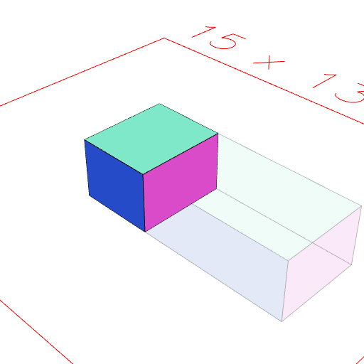

### sx()
dimension|1|Dimension by which to scale along the x axis

The shape is scaled along those dimensions.

Negative dimensions are supported.

See: [scale](../../nb/api/scale.nb), [sy](#https://raw.githubusercontent.com/jsxcad/JSxCAD/master/nb/api/sy.nb), [sz](#https://raw.githubusercontent.com/jsxcad/JSxCAD/master/nb/api/sz.md).

```JavaScript
Box([0, 5], 3, 2).op(ghost(), sx(-0.5)).view();
```


