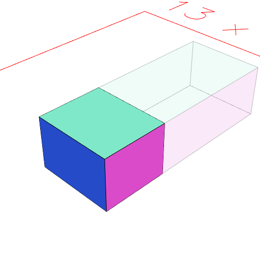

### sy()
dimension|1|Dimension by which to scale along the y axis

The shape is scaled along those dimensions.

Negative dimensions are supported.

See: [scale](#https://raw.githubusercontent.com/jsxcad/JSxCAD/master/nb/api/scale.nb), [sx](#https://raw.githubusercontent.com/jsxcad/JSxCAD/master/nb/api/sx.nb), [sz](#https://raw.githubusercontent.com/jsxcad/JSxCAD/master/nb/api/sz.nb).

```JavaScript
Box(3, [0, 5], 2).op(ghost(), sy(-0.5)).view();
```


