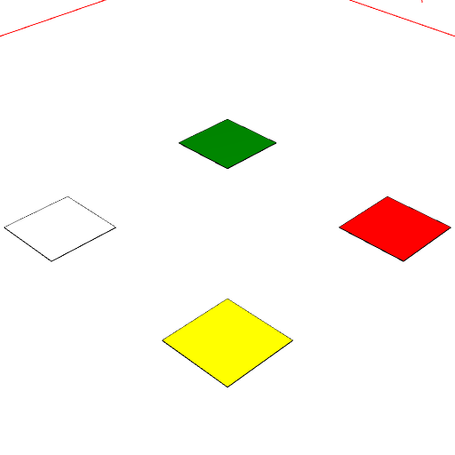
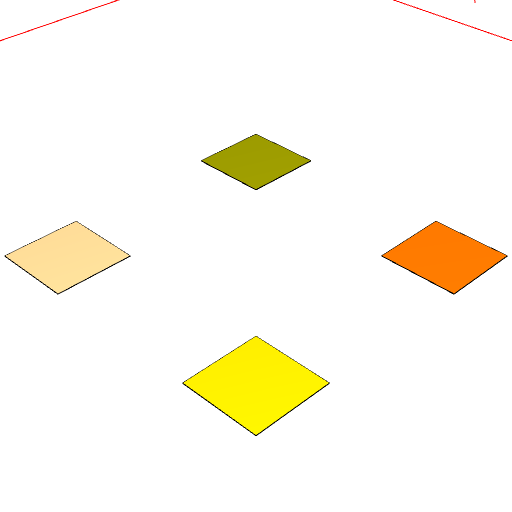

### tint()
Parameter|Default|Type
---|---|---
color||The name of the color to tint with.

Mixes the named color with all leaf geometry, merging with existing colors.

The names may be textual, e.g, 'red', or numeric, e.g., '#fafafe'.

See: [color](../../nb/api/color.md)

```JavaScript
Box()
  .op(color('white'), color('yellow'), color('green'), color('red'))
  .pack()
  .view(1)
  .note(
    "Box().op(color('white'), color('yellow'), color('green'), color('red')).pack()"
  )
  .op(tint('orange').as('orange'))
  .pack()
  .view(2)
  .note("tint('orange')");
```



Box().op(color('white'), color('yellow'), color('green'), color('red')).pack()



tint('orange')
