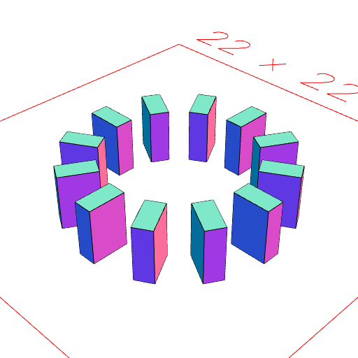

### to()
Parameter|Default|Type
---|---|---
reference||The reference to move to.

Moves shape so that its origin is aligned at the reference.

See: [at](../../nb/api/at.md)

```JavaScript
Box(1, 2, 3)
  .to(
    Ref()
      .rz(1 / 4)
      .x(5)
      .seq({ by: 1 / 12 }, rz)
  )
  .view()
  .note(
    'Box(1, 2, 3).to(Ref().rz(1 / 4).x(5).seq({ by: 1 / 12 }, rz)) arranges the box at 12 reference points around a circle.'
  );
```



Box(1, 2, 3).to(Ref().rz(1 / 4).x(5).seq({ by: 1 / 12 }, rz)) arranges the box at 12 reference points around a circle.
