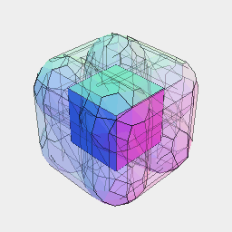
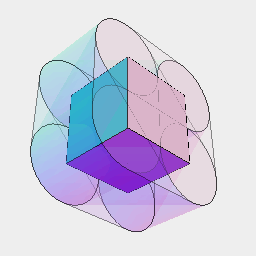
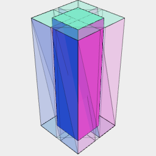
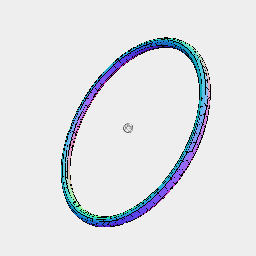
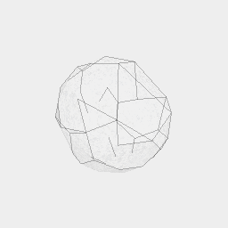

[index](../../nb/api/index.md)
### trim()
Parameter|Default|Type
---|---|---
tool||Shape to trim by

Generates a shape around the edges of the input by growing them with a minkowski sum with the tool.

This shape can then be used to trim the input.



The box is trimmed by 5 mm in all directions.

```JavaScript
Box(5, 5, 5)
  .and(trim(Orb(5)).ghost())
  .view()
  .note('The box is trimmed by 5 mm in all directions.');
```



The box is rounded out by 5 mm in Y.

```JavaScript
Box(5, 5, 5)
  .and(trim(ArcY(5)).ghost())
  .view()
  .note('The box is rounded out by 5 mm in Y.');
```



Box(5, 5, 20).and(trim(Box(4)).ghost()) trims the box 4 mm horizontally with sharp corners.

```JavaScript
Box(5, 5, 20)
  .and(trim(Box(4)).ghost())
  .view()
  .note(
    "Box(5, 5, 20).and(trim(Box(4)).ghost()) trims the box 4 mm horizontally with sharp corners."
  );
```



Arc(20).trim(Orb(1)) trims a disc

```JavaScript
Arc(20)
  .trim(Orb(1))
  .view()
  .note("Arc(20).trim(Orb(1)) trims a disc");
```



Arc(20).points().trim(Orb(1)) trims the points of an circle into spheres

```JavaScript
Arc(20)
  .points()
  .trim(Orb(1))
  .view()
  .note("Arc(20).points().trim(Orb(1)) trims the points of an circle into spheres");
```


Arc(20).outline().trim(Orb(1)) trims the rim of a circle into a tube

```JavaScript
Arc(20)
  .outline()
  .trim(Orb(1))
  .view()
  .note("Arc(20).outline().trim(Orb(1)) trims the rim of a circle into a tube");
```
