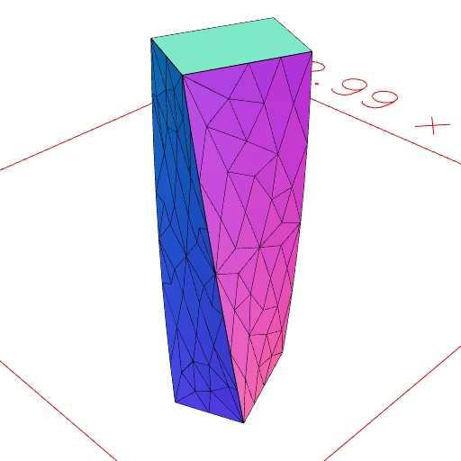

### twist()
Parameter|Default|Type
---|---|---
turnsPerMm|1|Turns around z for each mm along z.

This twists the shape by moving vertices. The shape may need remeshing or seams added.

See: [remesh](../../nb/api/remesh.nb), [seam](#https://raw.githubusercontent.com/jsxcad/JSxCAD/master/nb/api/seam.md)

_Note: May produce self-intersection._

```JavaScript
Box(2, 3, 10)
  .remesh(1)
  .twist(1 / 40)
  .view()
  .note('Box(2, 3, 10).remesh(1).twist(1 / 40)');
```



Box(2, 3, 10).remesh(1).twist(1 / 40)
