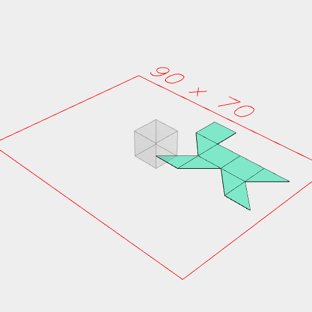
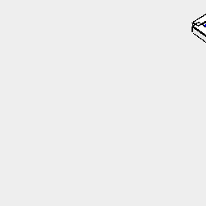

[index](../../nb/api/index.md)
### unfold()
Parameter|Default|Type
---|---|---

Unfolds a solid into a set of flat faces and edges suitable for folding back into the original shape.

The faces are tagged with 'unfold:faces' and each fold edge is tagged with 'fold:edge'.

```JavaScript
await Box(10)
  .ez(10)
  .unfold()
  .view()
  .note('Box(10).ez(10).unfold()');
```



Box(10).ez(10).unfold()

```JavaScript
await Box(10)
  .ez(10)
  .unfold()
  .on(get('unfold:faces'), color('blue').ez(0.1))
  .and(on(get('unfold:edge'), (e) => Box(1).ez(e.diameter()).color('white')))
  .view()
  .note(`Box(10).ez(10).unfold().on(get('unfold:faces'), color('blue').ez(0.1)).and(on(get('unfold:edge'), (e) => Box(1).ez(e.diameter()).color('white')))`);
```



Box(10).ez(10).unfold().on(get('unfold:faces'), color('blue').ez(0.1)).and(on(get('unfold:edge'), (e) => Box(1).ez(e.diameter()).color('white')))
