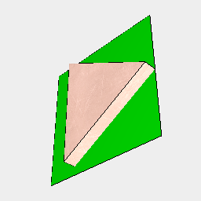
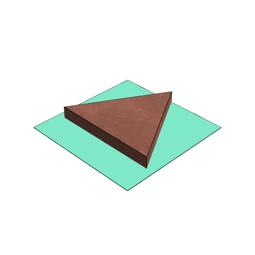

### untag()
Parameter|Default|Type
---|---|---
...tags||Tags to remove.

This removes the tags specified.

Unqualified tags are in the 'user' namespace.

See: [tag](../../nb/api/tag.md).

```JavaScript
Box()
  .tag('a')
  .color('green')
  .and(Triangle().ez(0.1).tag('b').material('copper'))
  .view(1)
  .note(
    "Box().tag('a').color('green').and(Triangle().ez(0.1).tag('b').material('copper'))"
  )
  .on(get('user:a'), untag('color:green'))
  .view(2)
  .note(
    "on(get('user:a'), untag('color:green')) removes the color:green tag from the Box with the 'user:a' tag."
  );
```



Box().tag('a').color('green').and(Triangle().ez(0.1).tag('b').material('copper'))



on(get('user:a'), untag('color:green')) removes the color:green tag from the Box with the 'user:a' tag.
