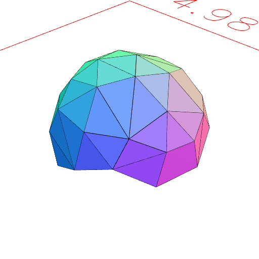

### upperEnvelope()

Generates a shape that covers the top of the shape.

The envelope is monotonic - there is no vertical convexity.

The envelope is safe for vertical extrusion.

See: [lowerEnvelope](../../nb/api/lowerEnvelope.md)

```JavaScript
Orb(5).upperEnvelope().view().note('The upper envelope of a rough sphere.');
```



The upper envelope of a rough sphere.
