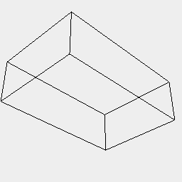
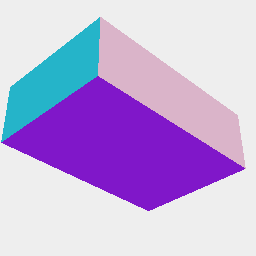
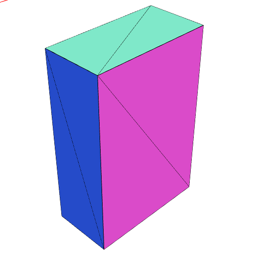
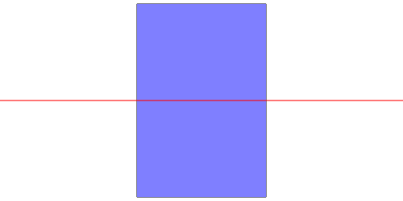
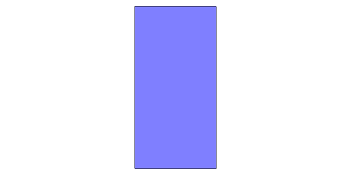
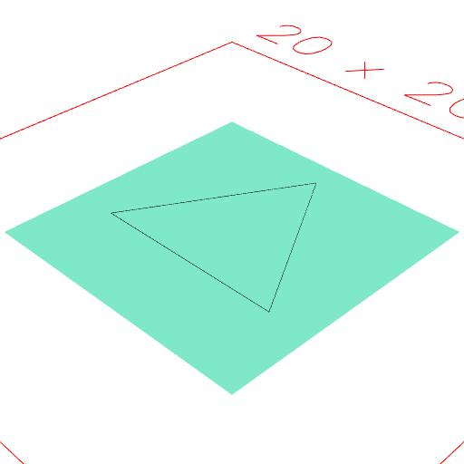

### view()
Parameter|Default|Type
---|---|---
viewId||Value giving a unique view id for this statement.
op||Function to transform the incoming shape for viewing.
{size}|512|
'noSkin'|false|Do not show the surfaces.
'noOutline'|false|Do not show outlines.
'wireframe'|false|Show wireframe edges.
'grid'|false|Show a grid view.
'side'|false|Show a side view.
'top'|false|Show a top view.

```JavaScript
Box(1, 2, 3).view(0, 'noSkin').note("Box(1, 2, 3).view(0, 'noSkin')");
```



Box(1, 2, 3).view(0, 'noSkin')

```JavaScript
Box(1, 2, 3).view(0, 'noOutline').note("Box(1, 2, 3).view(0, 'noOutline')");
```



Box(1, 2, 3).view(0, 'noOutline')

```JavaScript
Box(1, 2, 3).view(0, 'wireframe').note("Box(1, 2, 3).view(0, 'wireframe')");
```



Box(1, 2, 3).view(0, 'wireframe')

```JavaScript
Box(1, 2, 3).view(0, 'side').note("Box(1, 2, 3).view(0, 'side')");
```



Box(1, 2, 3).view(0, 'side')

```JavaScript
Box(1, 2, 3).view(0, 'top').note("Box(1, 2, 3).view(0, 'top')");
```



Box(1, 2, 3).view(0, 'top')

```JavaScript
Box(10)
  .tag('show:noOutline')
  .and(Triangle(8))
  .view()
  .note("Box(10).tag('show:noOutline').and(Triangle(8))");
```



Box(10).tag('show:noOutline').and(Triangle(8))
