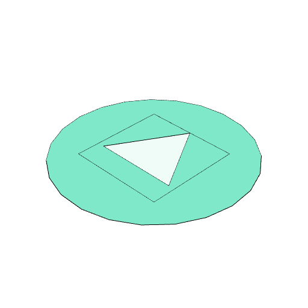

### void()

The shape is marked as a void.

It will be used in subtractive operations but not additive operations.

See: [noVoid](../../nb/api/noVoid.md).

```JavaScript
Box()
  .fitTo(Triangle().void())
  .fit(Arc(2))
  .view()
  .note(
    'Box().fitTo(Triangle().void()).fit(Arc(2)) fits a void triangle into the box.'
  )
  .note(
    'In the later fitting with an circle the void triangle continues to assert a hole.'
  );
```



Box().fitTo(Triangle().void()).fit(Arc(2)) fits a void triangle into the box.

In the later fitting with an circle the void triangle continues to assert a hole.
