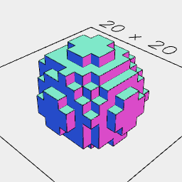

[index](../../nb/api/index.md)
### voxels()
Parameter|Default|Type
---|---|---
resolution|1|Number of mm long each voxel is.



Orb(10).voxels()

```JavaScript
Orb(10).voxels().view().note('Orb(10).voxels()');
```
