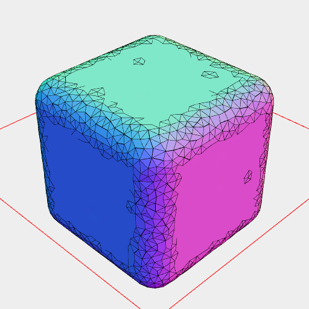

[index](../../nb/api/index.md)
### wrap()
Parameter|Default|Type
---|---|---
offset|1|The distance of the wrap from the shape.
alpha|0.1

The shape is wrapped in an offset surface.

The points and faces of the shape are considered.

The result is guaranteed to be a watertight manifold volume.

_Check: the description seems off._



```JavaScript
Box(10, 10, 10).wrap(0.5, 2).view();
```
