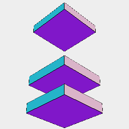

[index](../../nb/api/index.md)
### x()
Parameter|Default|Type
---|---|---
...offsets||Number of mm along x to move the shape.

See: [y](../../nb/api/y.nb), [z](#https://raw.githubusercontent.com/jsxcad/JSxCAD/master/nb/api/z.md).

_Note: Should support ranged dimensions._



Box(1, 5, 5).x(-5, 2, 5)

```JavaScript
Box(1, 5, 5).x(-5, 2, 5).view().note('Box(1, 5, 5).x(-5, 2, 5)');
```
