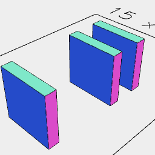

[index](../../nb/api/index.md)
### y()
Parameter|Default|Type
---|---|---
...offsets||Number of mm along y to move the shape.

See: [x](../../nb/api/x.nb), [z](#https://raw.githubusercontent.com/jsxcad/JSxCAD/master/nb/api/z.md).

_Note: Should support ranged dimensions._

```JavaScript
Box(5, 1, 5).y(-5, 2, 5).view().note('Box(5, 1, 5).y(-5, 2, 5)');
```



Box(5, 1, 5).y(-5, 2, 5)
