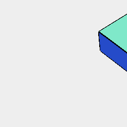

[index](../../nb/api/index.md)
### z()
Parameter|Default|Type
---|---|---
...offsets||Number of mm along z to move the shape.

See: [x](../../nb/api/x.nb), [y](#https://raw.githubusercontent.com/jsxcad/JSxCAD/master/nb/api/y.md).



Box(5, 5, 1).z(-5, 2, 5)

```JavaScript
Box(5, 5, 1).z(-5, 2, 5).view().note('Box(5, 5, 1).z(-5, 2, 5)');
```
