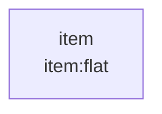
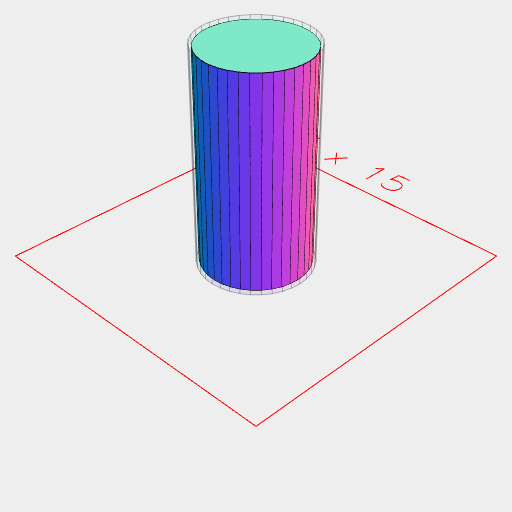
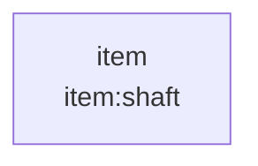
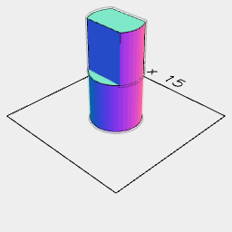
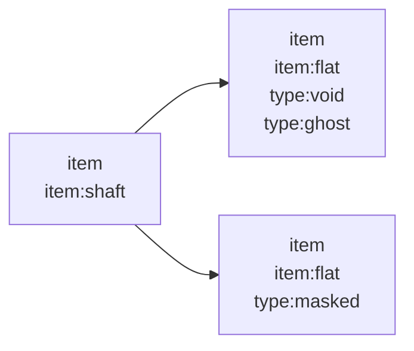

### Shaft, Flat, and FlatShaft

```JavaScript
export const Flat = ({ diameter = 10, length = 10, thickness = 5 } = {}) =>
  Arc(diameter).clip(Box(diameter, thickness)).ez(length).clean().as('flat');
```

```JavaScript
export const Shaft = ({ diameter = 10, length = 10, play = 0.2 } = {}) =>
  Arc(diameter).ez(length).clean().masked(grow(play)).as('shaft');
```

```JavaScript
export const FlatShaft = ({
  diameter = 10,
  length = 10,
  flatLength = 10,
  flatThickness = 5,
  play = 0.2,
} = {}) =>
  Group(
    Arc(diameter).ez(length - flatLength),
    Flat({ diameter, length: flatLength, thickness: flatThickness }).z(
      length - flatLength
    )
  )
    .clean()
    .masked(grow(play))
    .as('shaft');
```

```JavaScript
const diameter = control('diameter', 5, 'input');
```

```JavaScript
const length = control('length', 10, 'input');
```

```JavaScript
const flatLength = control('flat length', 5, 'input');
```

```JavaScript
const flatThickness = control('flat thickness', 3, 'input');
```

```JavaScript
const play = control('play', 0.2, 'input');
```

```JavaScript
await Flat({ diameter, length: flatLength, thickness: flatThickness })
  .view()
  .note(
    "import { Flat } from 'https://raw.githubusercontent.com/jsxcad/JSxCAD/master/nb/components/shaft.nb';"
  )
  .note(
    `Flat({ diameter: ${diameter}, length: ${flatLength}, thickness: ${flatThickness} })`
  )
  .abstract();
```


import { Flat } from 'https://raw.githubusercontent.com/jsxcad/JSxCAD/master/nb/components/shaft.nb';

Flat({ diameter: 5, length: 5, thickness: 3 })



```JavaScript
await Shaft({ diameter, length, play })
  .view()
  .note("import { Shaft } from 'https://raw.githubusercontent.com/jsxcad/JSxCAD/master/nb/components/shaft.nb';")
  .note(`Shaft({ diameter: ${diameter}, length: ${length}, play: ${play} })`)
  .abstract();
```



import { Shaft } from 'https://raw.githubusercontent.com/jsxcad/JSxCAD/master/nb/components/shaft.nb';

Shaft({ diameter: 5, length: 10, play: 0.2 })



```JavaScript
await FlatShaft({
  diameter,
  length,
  flatLength,
  flatThickness,
  play,
})
  // .on(get('shaft').in().get('flat'), fit(Arc(10).ez(1, 2).material('acrylic')))
  .view()
  .note(
    "import { FlatShaft } from 'https://raw.githubusercontent.com/jsxcad/JSxCAD/master/nb/components/shaft.nb';"
  )

  .note(
    `FlatShaft({ diameter: ${diameter}, length: ${length}, flatLength: ${flatLength}, flatThickness: ${flatThickness}, play: ${play} })`
  )
  .abstract();
```



import { FlatShaft } from 'https://raw.githubusercontent.com/jsxcad/JSxCAD/master/nb/components/shaft.nb';

FlatShaft({ diameter: 5, length: 10, flatLength: 5, flatThickness: 3, play: 0.2 })


