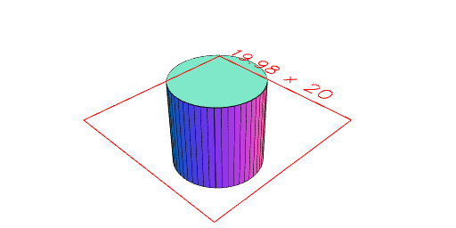
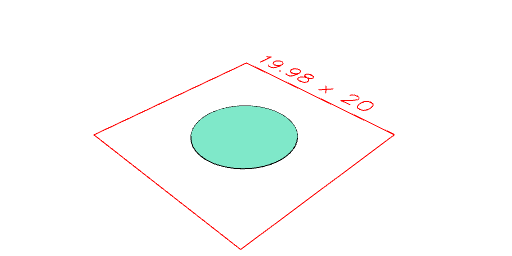
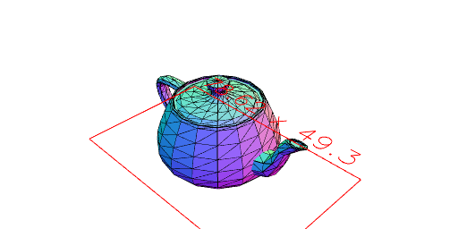
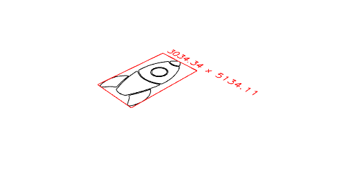

# File IO
JSxCAD supports importing and exporting .svg and .stl file types

---
### Exporting .stl
Creates an option to download the shape as an stl file. A view is created to show what will be downloaded.

---
### Exporting .svg
Creates an option to download the shape as a svg file. A view is created to show what will be downloaded.

---
### Importing .stl
Imports a .stl file which can then be used as geometry. A best effort is made to handle bad geometry in the .stl file.

---
### Importing .svg
Imports a .svg file which can then be used as geometry.

