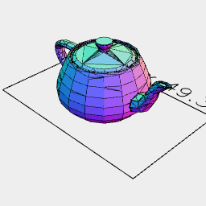

# File IO
JSxCAD supports importing and exporting .svg and .stl file types

One thing to note is that output may consist of multiple 'pages'.

A filename like 'teapot' will have the page number and filetype appended, so it may produce 'teapot_0.stl', 'teapot_1.stl', etc.

---
### Exporting .stl
Creates an option to download the shape as an stl file. A view is created to show what will be downloaded.

```JavaScript
await Arc(10, 10, 10).stl('fileName');
```

---
### Exporting .svg
Creates an option to download the shape as a svg file. A view is created to show what will be downloaded.

```JavaScript
await Arc(10).svg('fileName');
```

---
### Importing .stl
Imports a .stl file which can then be used as geometry. A best effort is made to handle bad geometry in the .stl file.

```JavaScript
const importedStl = await LoadStl('https://jsxcad.js.org/stl/teapot.stl', 500);
```



```JavaScript
importedStl.view('teapot');
```

---
### Importing .svg
Imports a .svg file which can then be used as geometry.
