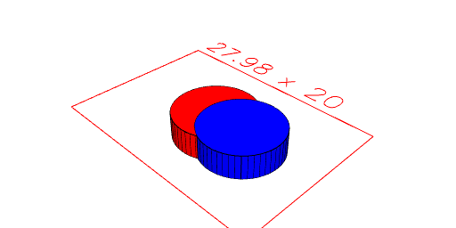
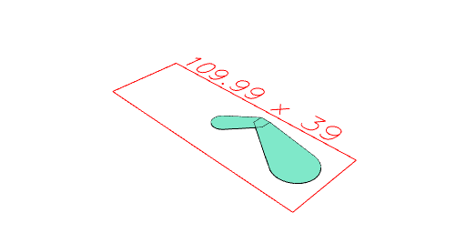
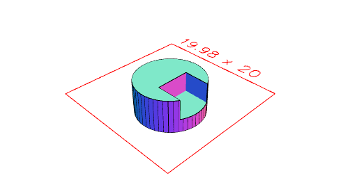
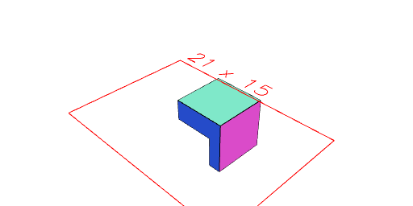
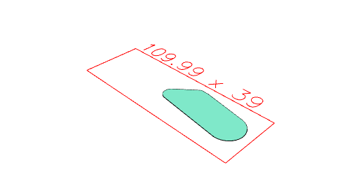

---
# Interactions between geometry
JSxCAD offers a number of ways to interact two or more geometries to create new geometry. Most of these operations will work on both 2D and 3D geometry.

---
### ADD
Returns the union of the input shapes.

---
### Assembly
Assembles together two or more 2D or 3D shapes to form a single one. Shapes interact subtractively with shapes later in the arguments list meaning that no overlap is allowed in the generated assembly. See Group as an alternative.

---
### ChainedHull
Performs the hull operation sequentially on the input shapes

---
### Clip
Finds the overlapping volume of two shapes.

---
### Cut
Subtracts one shape from another.

---
### Group
Similar to Assembly, group joins together a number of shapes, however unlike Assembly, Group does not subtract the shapes which means they are allowed to overlap which makes Group much faster to compute than Assembly. Group can also be done using the .and() operator.

---
### Hull
Performs the hull operation on the input shapes.

---
### Pack
Pack takes input geometry and lays it out on a sheet. Groups and Assemblies are split apart, but items are preserved.

