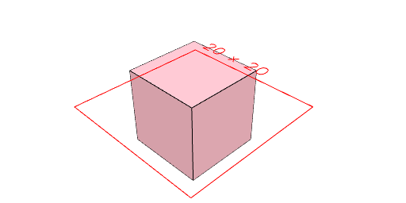
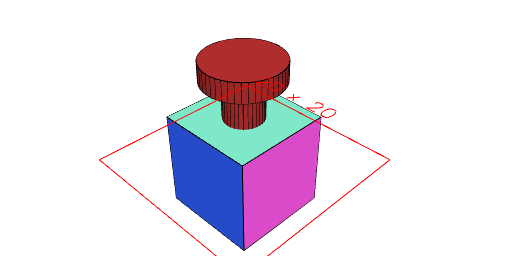
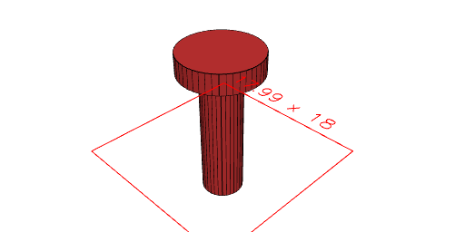
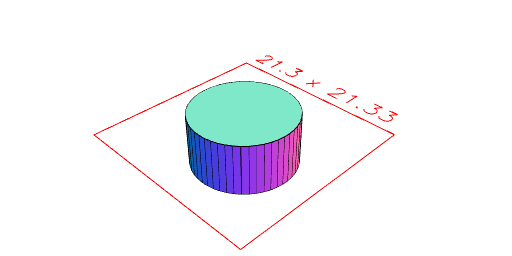
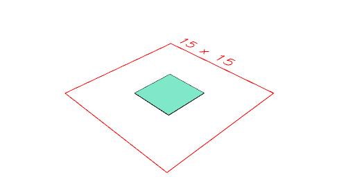

# Interactions with Geometry
JSxCAD provides a number of functions to modify existing geometry.

---
### Color
Geometry can be given a color

---
### Extrude
2D shapes can be 'extruded' to create 3D shapes. This can be abbreviated to .ex() for brevity.

---
### Item
Geometry can be defined to be an "item". Items are a way to identify individual elements within an assembly or group. Items are different from tags in that an item is a monolithic entity, while an object with a tag is a collection of individual geometry elements each of which has that tag. Items ideally correspond to real world physical items.

---
### Grow
Expands the shape outwards by the input distance. May result in self intersections if not used cautiously.

---
### Move
A shape can be moved in XYZ space using the .move(x,y,z) command. These can also be shortened to .x(), .y(), or .z() if a movement in only one axis is needed.

---
### Remesh
Remesh can be used to break up the segments of a shape allowing it to be distorted. .remesh(4, 2) first breaks segments longer than 4 and then breaks segments longer than 2. Then the shape is re-triangularized.

Once a shape is remeshed it can be twisted or bent about the origin.

---
### Rotate
A shape can be rotated about the origin using the .rx(), .ry(), and .rz() commands. These take an argument of a fraction of a rotation, so .rz(1/8) would rotate the shape by 1/8th of a rotation.

---
### Scale
Scale enlarges a shape by the entered multiple.

---
### Section
Section takes a 2D slice of a 3D shape. By default the slice is taken where the shape intersects the XY plane.

---
### Size
Size returns the size of the shape along with it's bounding box corners.

---
### Tags
Tags lists all of the tags associated with a shape.

Tags can be used to selectively keep or remove parts of geometry.

