# Interactions with Geometry
JSxCAD provides a number of functions to modify existing geometry.

---
### Color
Geometry can be given a color


```JavaScript
Box(10, 10, 10).color('pink').view();
```

---
### Extrude
2D shapes can be 'extruded' to create 3D shapes. This can be abbreviated to .e() for brevity.

A series of intervals can be provided. Zero will be added if an interval is missing a value.

e.g., s.ez([1, 2], [3, 4]) will produce two extrusions -- one from 1z to 2z, and one from 3z to 4z.

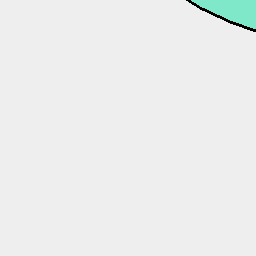

```JavaScript
Arc(10).view();
```

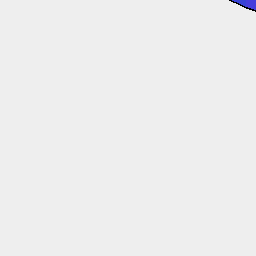

```JavaScript
Arc(10).ez([5]).view();
```

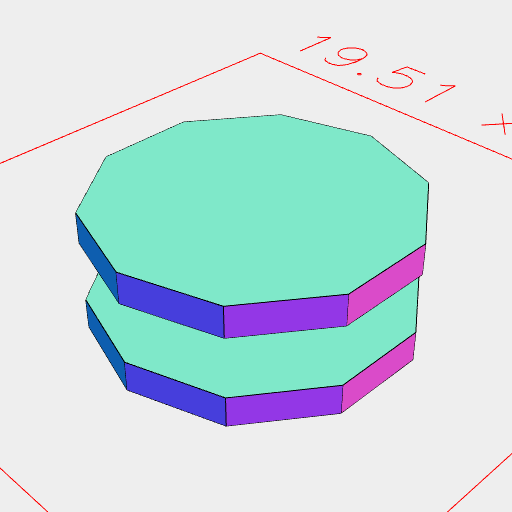

```JavaScript
Arc(10).ez([1, 2], [-1, -2]).view();
```

---
### Cast
3D shapes can be cast as shadows to create 2D shapes.

A plane (default XY(0)) to cast upon and a direction (default XY(1)) can be provided.

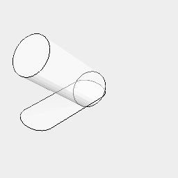

```JavaScript
Arc(4)
  .ez([10])
  .rx(1 / 8)
  .material('glass')
  .and(shadow())
  .view();
```

---
### Fuse

Shapes which are grouped, assembled, or otherwise associated can be fused together to form a single solid

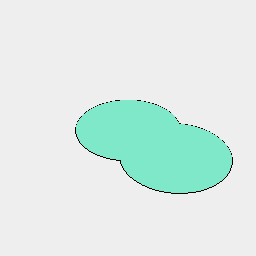

```JavaScript
Arc(10).x(0, 6).fuse().view();
```

---
### Inset
2D shapes can be inset creating a new shape smaller than the original by the specified amount. Hard inside corners are rounded.

```JavaScript
const a = Arc(20).cut(Box(10));
```

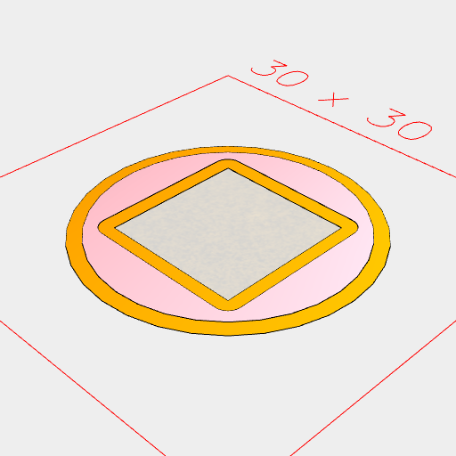

```JavaScript
Group(a.inset(1).z(0.1).color('pink'), a.color('orange')).view();
```

---
### Item
Geometry can be formed into an 'item'.

An item has an exterior (which looks like an individual piece of geometry), and an interior (which may contain many distinct pieces of geometry).

The interior has its own frame of reference independent of any transformation of the exterior of the item.

Since an item appears individual from the outside, tag and path selectors need to explicitly select item to access the interior.

There are a number of item specific operators. .in() will enter an item, .asPart("Bolt") will define an item which is specified as a part. Parts can be listed with the .bom() operation.

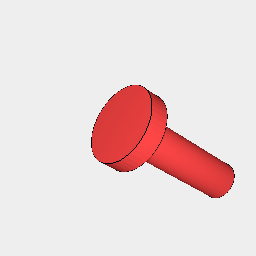

```JavaScript
const aBolt = Arc(8, 8, 2)
  .and(Arc(4, 4, 14).z(-7))
  .color('brown')
  .asPart('bolt')
  .view();
```

```JavaScript
const aBox = Box(10, 10, 10).as('box');
```

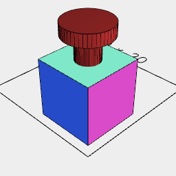

```JavaScript
const aDesign = aBox.fit(aBolt.z(10)).as('design').view();
```

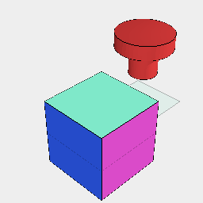

We need to get into the 'design' item in order to get at 'box' and 'bolt'

```JavaScript
aDesign
  .in()
  .pack()
  .view()
  .note(
    `We need to get into the 'design' item in order to get at 'box' and 'bolt'`
  );
```

---
### Grow
Expands the shape outwards by the input distance. May result in self intersections if not used cautiously.

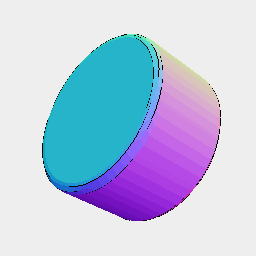

```JavaScript
Arc(10, 10, 5).grow(1).view();
```

---
### Loft
2D shapes can be 'lofted' to create 3D shapes. Lofting a shape is done by taking an input shape, transforming it incrementally, then joining all of the incremental steps into a single shape.

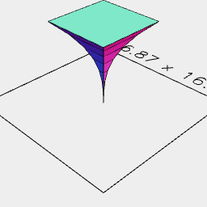

```JavaScript
Box(10)
  // .cut(Box(5))
  .seq(
    { from: 1 / 128, by: 1 / 8 },
    (a) => scale(Math.pow(a, 3)).z(a * 10),
    Loft
  )
  .view();
```

---
2D shapes can be 'looped' to create 3D shapes. In this example two circles are looped to create a hollow doughnut.

TODO: In the future (a) => rz(a) can be replaced with rz.

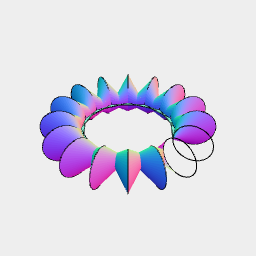

```JavaScript
Arc(6)
  // .cut(Arc(3))
  .rx(0.25)
  .x(10)
  .seq({ by: 1 / 16 }, rz, Loft)
  .view();
```

---
### Move
A shape can be moved in XYZ space using the .move(x,y,z) command.

These can also be shortened to .x(), .y(), or .z() if a movement in only one axis is needed.

Multiple offsets can be provided, which will produce one result per offset.

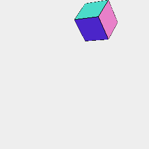

```JavaScript
Box(5, 5, 5).move(10, 2, 12).view();
```


```JavaScript
Box(5, 5, 5).x(10).y(2).z(12).view();
```

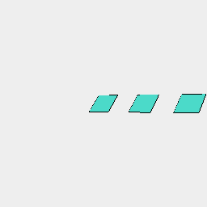

```JavaScript
Box(5).x(0, 10, 20).view();
```

---
### Offset 
2D shapes can be offset creating a new shape larger than the original by the specified amount. Hard exterior corners are rounded.

```JavaScript
const b = Arc(20).cut(Box(10)).fitTo(Box(5).x(10));
```

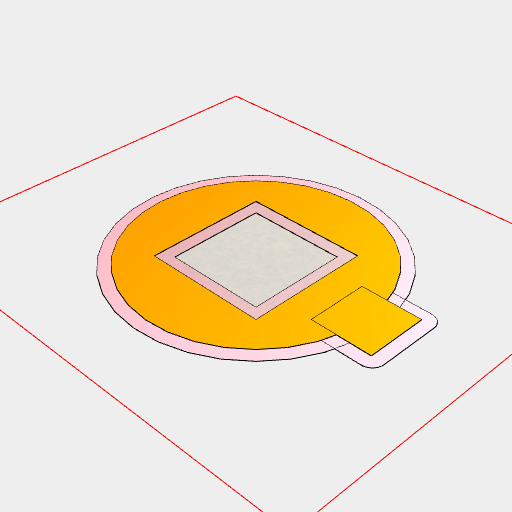

```JavaScript
Group(b.offset(1).z(-0.1).color('pink'), b.color('orange')).view();
```

---
### Remesh
Remesh can be used to break up the segments of a shape allowing it to be distorted.
shape.remesh(4, 2) first breaks segments longer than 4 and then breaks segments longer than 2.
At each step the shape is retriangulated to preserve manifold structure.

Once a shape is remeshed it can be twisted or bent about the origin.

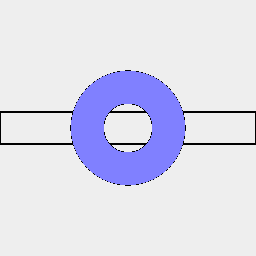

A rectangle bent into a ring with a central radius of 25

```JavaScript
Box(157, 20)
  .ez([1])
  .y(25)
  .remesh(10)
  .op((s) => s.bend(25).and(s.outline()))
  .gridView()
  .note('A rectangle bent into a ring with a central radius of 25');
```

---
### Rotate
A shape can be rotated about the origin using the .rx(), .ry(), and .rz() commands.
These take the number of turns as an argument .rz(1/8) would rotate the shape by 1/8th of a rotation.
Multiple turns can be provided, which will produce one result per turn.

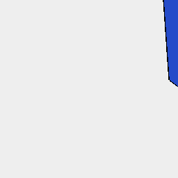

```JavaScript
const aRectangle = Box(5, 5, 15).view();
```

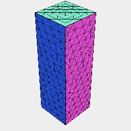

```JavaScript
aRectangle.remesh({ method: 'edgeLength', lengths: [4, 2] }).view('wireframe');
```

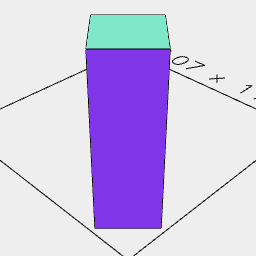

```JavaScript
aRectangle.rz(1 / 8).view();
```

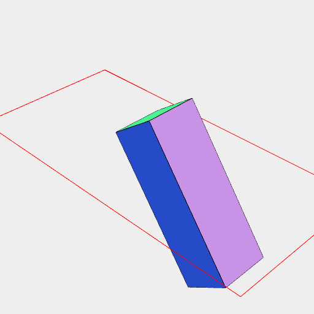

```JavaScript
aRectangle
  .rotateY(1 / 10)
  .x(4)
  .z(-2)
  .view();
```

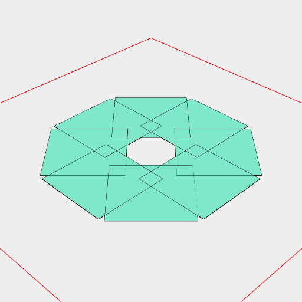

```JavaScript
Box(5)
  .x(4)
  .rz(0 / 8, 1 / 8, 2 / 8, 3 / 8, 4 / 8, 5 / 8, 6 / 8, 7 / 8)
  .view();
```

---
### Scale
Scale enlarges a shape by the entered multiple. .scale(x,y,z) can be used to scale asymmetrically

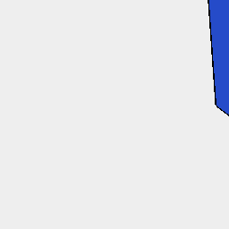

```JavaScript
aRectangle.scale(2).view();
```

---
### Section
Section takes a 2D slice of a 3D shape.

By default the slice is taken where the shape intersects the XY plane.

Section takes shapes as arguments, and will use the plane of orientation of the shape.

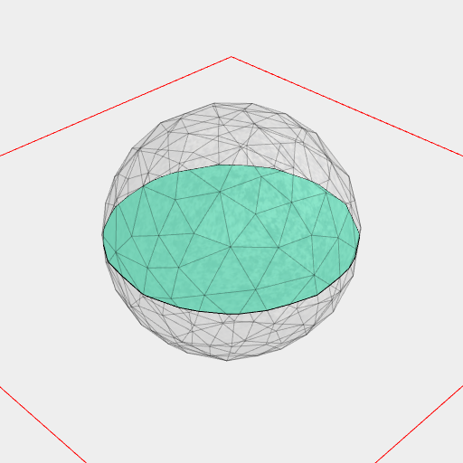

```JavaScript
Orb(4).section().view();
```

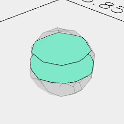

```JavaScript
Orb(4).section(Point().z(0), Point().z(1), Point().z(2)).view();
```

---
### Size
Size returns the size of the shape along with it's bounding box corners.

A function can be provided to receive the dimensions along with the shape.

Move the shape along by its length

```JavaScript
aRectangle
  .x(size('length'))
  .note(`Move the shape along by its length`);
```

---
### Tags
Tags lists all of the tags associated with a shape.

A function can be supplied to receive the tags and shape.

Tags [object Object]

Tags user:tagString

```JavaScript
aRectangle.tag('tagString').tags((tags) => note(`Tags ${tags}`));
```

Tags can be used to selectively drop parts of geometry.

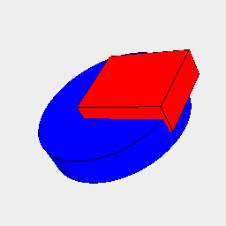

```JavaScript
const taggedAssembly = Assembly(
  Arc(10, 10, 2).color('blue').tag('A'),
  Box(6, 5, 2).move(2, 1, 1).color('red').tag('B')
).view();
```

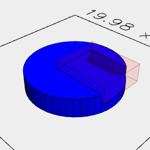

```JavaScript
taggedAssembly.drop(get('user:B')).view();
```

---
#### Selection
We can select parts of geometry based on tags using get(selector), getNot(selector), and nth(number).
Aliases g, ng, and n are also available.

Selector is in the form of 'namespace:value', with namespace defaulting to 'item'.

value may also be the wildcard *.

Selection does not traverse through item, except for the input shape.

This means that s.get('a').get('b') will find b inside a, but otherwise b would not be found.

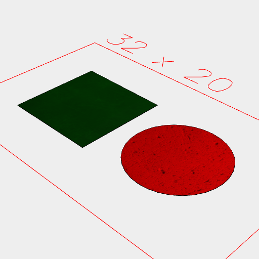

All items.

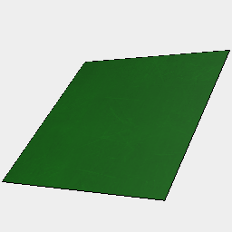

All green things.

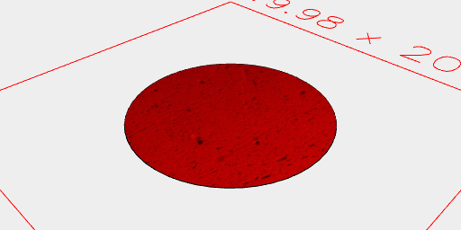

All non-copper things.

```JavaScript
Group(
  Box(10).as('box').color('green').material('copper'),
  Arc(10).as('arc').color('red').material('brick')
)
  .view(1, get('*').pack())
  .note('All items.')
  .view(2, get('color:green'))
  .note('All green things.')
  .view(3, getNot('material:copper'))
  .note('All non-copper things.');
```

---
### Abstract View
We can generate an abstract view of the geometry to be displayed as a graph.

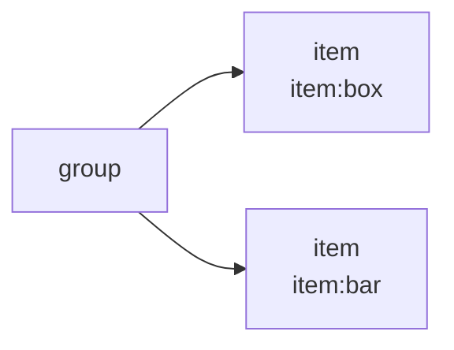

```JavaScript
Box(4).as('box').and(Arc(5).ez([10]).as('bar')).abstract();
```

---
### Voxels
We can convert a volume into voxels at a given resolution.


Produce a voxel representation with a 1mm resolution

```JavaScript
Box(11)
  .ez([10])
  .rx(-1 / 8)
  .op((s) => s.voxels(1).color('green').and(s.outline().sketch().color('red')))
  .view()
  .note('Produce a voxel representation with a 1mm resolution');
```
