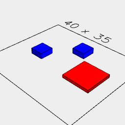
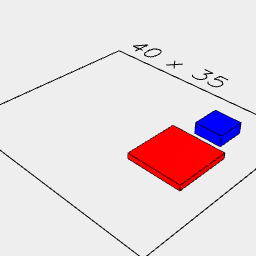
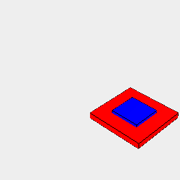

# Reference Geometry

Each shape in jot has it's own frame of reference which can be accessed. A shapes internal frame of reference can be used to position a new shape relative to an existing shape. A shapes frame of reference can be redefined by defining it as an item

```JavaScript
const a = await Box(10, 10, 1).color('red').x(10);
```

```JavaScript
const b = await Box(5, 5, 2).color('blue').y(10);
```


```JavaScript
await Group(a, b).view();
```

---
### Align
Returns a point relative to a shape which can be used for positioning other shapes. Behavior needs to be updated to function this way.



```JavaScript
await Group(a, b, b.to(a.alignment('<x'))).view();
```

---
### At
Performs an operation on a shape at a particular location.

```JavaScript
await b.and(a.at(b, cut(b))).view(); //Moves a to b, makes the cut, then moves a back to it's original location
```

---
### By
Moves a shape from it's current location by a reference amount.



```JavaScript
await a.and(b.by(a)).view(); //Moves the blue square in the X direction the same amount that the red square had been moved
```

---
### To
Moves a shape to a reference position.



```JavaScript
await a.and(b.to(a)).view(); //Moves the blue square to the red square
```
