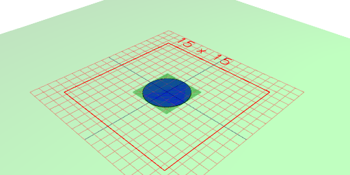
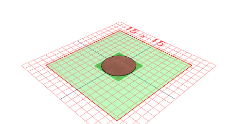
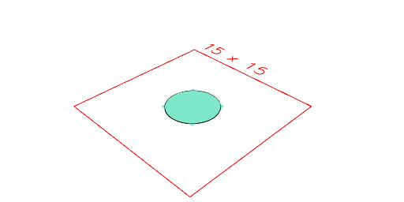
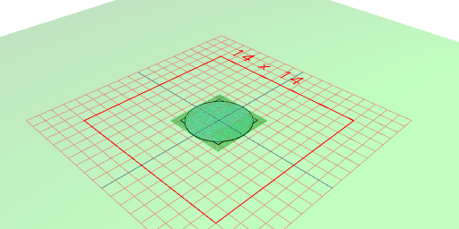

---
# Tags

Geometry carries qualified tags which can be used for selection and in display.

The fundamental operations are Shape.tag(...tags) and Shape.untag(...).

Tags are qualified with namespaces, such as user:, color:, material:, part:, etc.

The default namespace is 'user'.

A wildcard tag is reserved and used to match any tag within a namespace.

```JavaScript
Arc(5).tag('ring', 'color:blue').view();
```



```JavaScript
Arc(5).tag('ring', 'color:blue', 'material:copper').untag('user:*', 'color:blue').view();
```



Shape.color() and shape.material() are provided as convenience operations.

Shape.drop() selects which sub-geometries to ghost (or otherwise transform).

```JavaScript
Arc(5).tag('a').fit(Box(4).tag('b')).drop(getNot('user:a')).view();
```



```JavaScript
Arc(5).tag('a').fit(Box(4).tag('b')).drop(get('user:a')).view();
```


