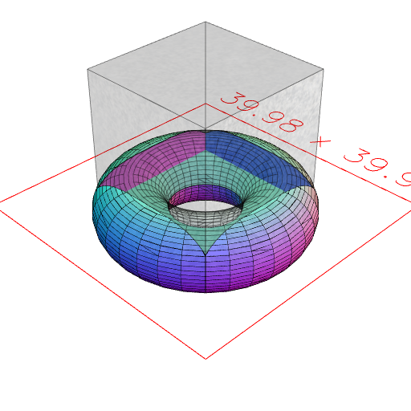
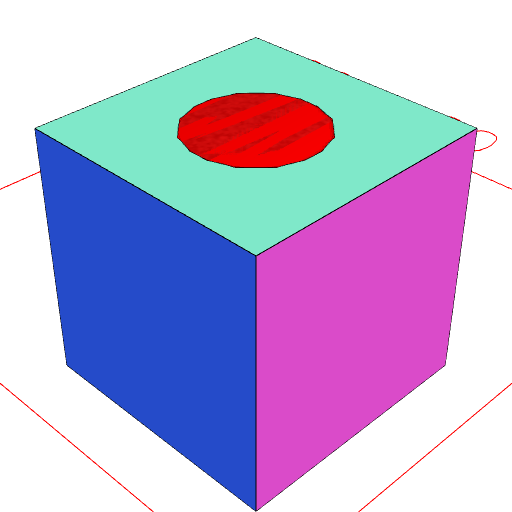

Hollow torus with void cut-out.

```JavaScript
Arc(10)
  // .cut(Triangle(5))
  .rx(1 / 4)
  .x(10)
  .seq({ by: 1 / 32 }, rz, Loft)
  .cutout(Box(20, 20).ez(20))
  .view();
```



Cube with red cut-out.

```JavaScript
Box(10, 10, 10)
  .cutout(Arc(5, 5, 10), cut => clipped => cut.and(clipped.color('red')))
  .view();
```


